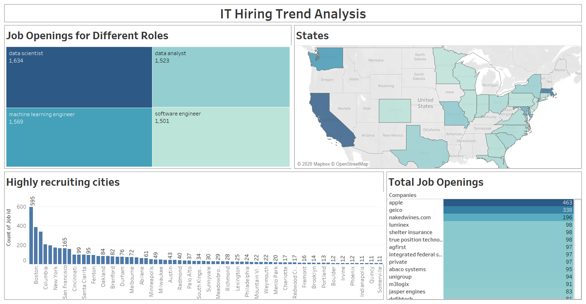
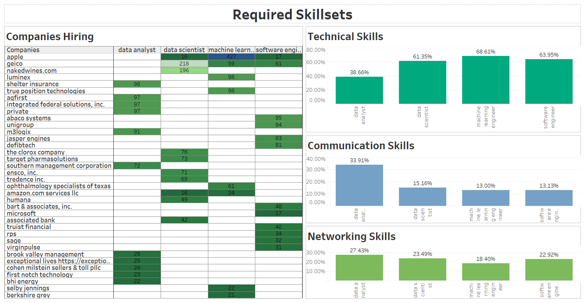

# ITHiringTrendAnalysis
---------------------------------------------------

The project performs text analysis on various job openings in the IT industry and identifies the technical keywords in them. It computes the highly demanded technical skills in the industry by visually representing the data on Tableau

## Keywords extraction
Identified 1000 tech keywords from PDFs by using the TF-IDF Algorithm to compute the frequencies of words in the document.

## Scraping
Created a raw dataset by Web scraping job description from a search engine with Beautifulsoup.

## Data storage
Storing the data in S3 bucket in the form of csv by configuring aws credentials on local system

#### AWS Configuration with aws cli
pip install awscli

aws configure

AWS Access Key : ACCESS_KEY

AWS Secret Key : SECREET_KEY

AWS Region : 'Your Region'

## Exploratory data analysis
Explored the dataset by identifying the null values, type of data collected, job descriptions extracted and discovered text in the data

## Word Count
Identified the tech word tokens from each job description by comparing the words with finalized keywords

Maintained the count of each word for every job description

Merged the counts with the remaining data to create a dataset having additional columns of key words storing the count

## Data Streaming
Implemented the live streaming of data with AWS Kinesis

Step 1: Implemented the live streaming of data with AWS Kinesis Step 1: Created a Kinesis Data stream to fetch the records with '|' delimiter within records (no of shards - 1)

Step 2: Created a Kinesis Data Delivery Strem (AWS Firehorse) which takes input from the data stream. Enable the SSE under data encryption and add the IP Address as per region under subnet groups to give VPC access

Step 3: Create a Lambda function which stores the data in the form of CSV on AWS S3

Step 4: Create a redshift database to store the data

Step 5: Write a copy command in the delivery stream configuration to copy the csv records from firehorse to redshift database

